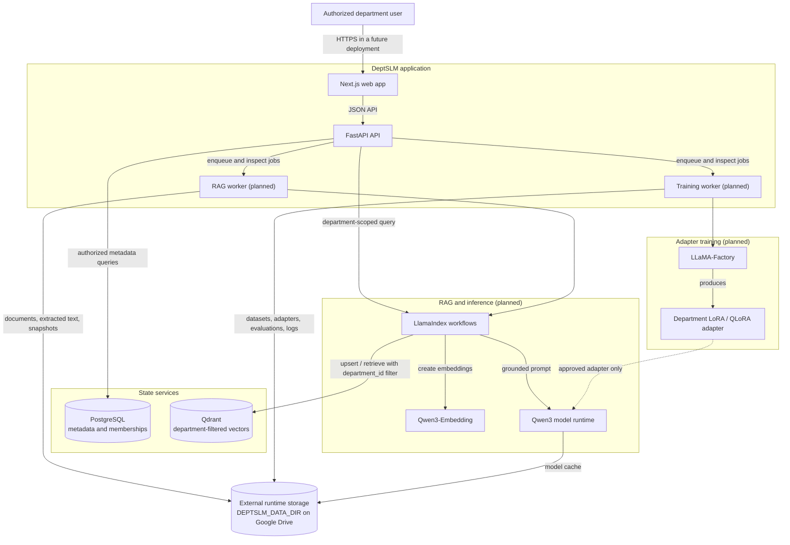

# Planned Architecture

## Status and boundaries

Phase 3 implements the PostgreSQL department, identity, membership, and mutation-audit control-plane foundation. The ingestion, retrieval, model-serving, training, and adapter flows below remain designs, not implemented capabilities.

## System context

DeptSLM is planned as a department-isolated monorepo application. The web client will call a FastAPI control plane. PostgreSQL will hold application metadata and authorization relationships; Qdrant will hold embeddings with department-scoped payloads. Long-running ingestion and training work will live outside request handlers. File-based artifacts will be stored outside the checkout under `DEPTSLM_DATA_DIR`.

The arrows describe intended responsibilities and do not imply that a production queue, model server, or network protocol has been selected in Phase 0.

## Component responsibilities

### Next.js frontend

`apps/web` is the browser-facing interface. In future phases it is expected to provide department-scoped document management, ingestion status, chat, training and evaluation views, and administrative controls. It must not be treated as an authorization boundary; the API must independently authenticate and authorize every operation.

### FastAPI backend

`apps/api` is the control plane for development authentication, persistent department authorization, and department administration. It uses synchronous request-scoped SQLAlchemy sessions and Alembic migrations. Long-running ingestion, model, and training work remains deferred and must not block API request workers.

### PostgreSQL

PostgreSQL stores Phase 3 identities, departments, memberships, and safe mutation audit events. Department-owned repository methods require an explicit `DepartmentScope`; later metadata such as documents and jobs remains deferred.

### Qdrant

Qdrant is the planned vector store for document chunks embedded by Qwen3-Embedding. Every department-owned point must include `department_id` in its payload. Every search, update, and delete must apply an authorized `department_id` filter; a missing filter is an error, never a global search fallback.

### LlamaIndex and the RAG worker

LlamaIndex is planned to coordinate parsing outputs, chunking, embedding, indexing, retrieval, and query assembly. The RAG worker will handle asynchronous ingestion and re-indexing work. Retrieved passages must retain document, chunk, and department provenance.

Retrieved text is untrusted content. Prompt assembly must delimit it as evidence, prevent instructions in it from overriding higher-priority policy, and include only sources from the authorized department. If retrieval does not yield usable evidence, the assistant must state that it does not have enough information rather than generate a department-specific claim.

### Qwen3 and Qwen3-Embedding

Qwen3 is the target base SLM for answer generation, and Qwen3-Embedding is the target embedding model. Exact model sizes, revisions, quantization, serving runtime, hardware requirements, context limits, and licensing checks will be selected and documented in a later phase. Model weights and caches must never enter Git history.

### LLaMA-Factory and the training worker

The training worker is planned to launch controlled LoRA or QLoRA jobs through LLaMA-Factory. Training data, outputs, logs, and adapters will live under `DEPTSLM_DATA_DIR`. Every dataset, job, evaluation, and adapter will be bound to a `department_id` and an exact base-model revision. Adapters should be evaluated and explicitly promoted before use; no cross-department adapter fallback is permitted.

### Shared package

`packages/shared` is reserved for contracts or utilities that genuinely need to be shared. It should not become a dumping ground or create a runtime dependency from Python to TypeScript; cross-language contracts should use an explicit schema or generated client once APIs stabilize.

## Planned workflows

### Document ingestion

1. The API authenticates the user and resolves an allowed `department_id` from membership.
2. The upload is written beneath that department's external `uploads` path.
3. The API records source metadata and schedules an ingestion job.
4. The RAG worker extracts and chunks the document, preserving provenance.
5. Qwen3-Embedding creates vectors.
6. LlamaIndex writes points to Qdrant with the required `department_id` payload.
7. Job state and audit metadata are recorded in PostgreSQL.

File validation, malware controls, supported formats, queue technology, retries, and deletion semantics remain to be designed.

### Department-scoped question answering

1. The API authenticates the caller and resolves the authorized department.
2. Retrieval queries Qdrant with a mandatory `department_id` filter.
3. The system evaluates whether retrieved passages are relevant enough to use.
4. LlamaIndex assembles a prompt that treats passages as untrusted evidence, not instructions.
5. Qwen3 generates an answer using an approved adapter only when one is configured for the same department.
6. The response returns source metadata for supported claims. With no adequate source, it returns the defined insufficient-information behavior.

### Adapter training and promotion

1. An authorized operator creates or selects a reviewed department dataset.
2. The training worker records the base-model revision and LLaMA-Factory configuration.
3. LLaMA-Factory produces a department-bound adapter under external storage.
4. Automated and human evaluation compare the candidate with the current approved behavior.
5. An authorized promotion action makes the adapter available to that department; rollback remains possible.

The exact training scheduler, GPU execution environment, registry schema, and approval workflow are future decisions.

## Isolation and trust boundaries

`department_id` is a mandatory security boundary, not a UI filter. In future phases it must be enforced in authentication-derived request context, PostgreSQL queries and constraints, Qdrant payload filters, job messages, paths, cache keys, adapters, logs, evaluations, and exports. Client-provided identifiers are not sufficient authorization. Missing or ambiguous scope must fail closed.

The browser, uploaded files, extracted text, document metadata, retrieved passages, and model output are untrusted. The API must validate inputs and authorize operations; prompt assembly must resist document-borne instructions; rendered output must be escaped for its context. Secrets should enter through environment or a future secret manager and must not be exposed to prompts or logs.

## Persistence boundary

The repository is for source code only. All file-based runtime artifacts derive from the required `DEPTSLM_DATA_DIR`; in the user's local environment it points to Google Drive. No component may silently create runtime directories inside the checkout. Tests and CI substitute isolated temporary directories. See [storage-policy.md](storage-policy.md).

PostgreSQL and Qdrant are service state. The Phase 0 Compose file is only a local placeholder; before either stores real data, its persistence, backup, and recovery design must be reviewed to ensure no runtime files are written into the repository and that department deletion and retention requirements can be met.

## Deferred decisions

- Authentication provider, SSO integration, and role model
- Queue and worker execution technology
- Exact Qwen3 variants, serving runtime, and hardware profiles
- Supported document formats and extraction sandbox
- Chunking, hybrid retrieval, reranking, and relevance thresholds
- Schema, migrations, retention, deletion, and audit requirements
- Adapter evaluation gates and promotion workflow
- Production topology, secrets, observability, backup, and disaster recovery
