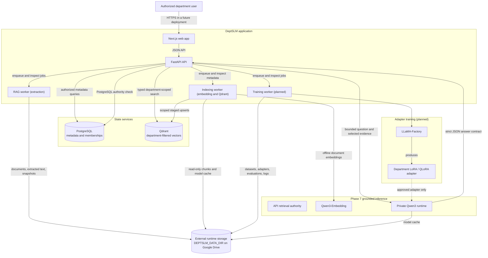

# Planned Architecture

## Status and boundaries

Phase 7's one-turn grounded-answer boundary is complete. Phase 8 adds structured PostgreSQL-only feedback, a constrained same-department review workflow, server-time expiry, and explicit authorized purge. Feedback persists no question, answer, prompt, evidence, or free text and cannot contact Qdrant, artifacts, or the private runtime. Public vector search, conversations, streaming, reranking, evaluation, training, and adapter flows remain unimplemented.

## System context

DeptSLM is planned as a department-isolated monorepo application. The web client will call a FastAPI control plane. PostgreSQL will hold application metadata and authorization relationships; Qdrant will hold embeddings with department-scoped payloads. Long-running ingestion and training work will live outside request handlers. File-based artifacts will be stored outside the checkout under `DEPTSLM_DATA_DIR`.

The arrows describe intended responsibilities and do not imply that a production queue, model server, or network protocol has been selected in Phase 0.

## Component responsibilities

### Next.js frontend

`apps/web` is the browser-facing interface. In future phases it is expected to provide department-scoped document management, ingestion status, chat, training and evaluation views, and administrative controls. It must not be treated as an authorization boundary; the API must independently authenticate and authorize every operation.

### FastAPI backend

`apps/api` is the control plane for development authentication, persistent department authorization, department administration, uploads, and extraction metadata. It enqueues PostgreSQL jobs but never opens sources for extraction, invokes parsers, normalizes, chunks, or waits for workers.

### PostgreSQL

PostgreSQL stores identities, departments, memberships, documents, extraction/chunk metadata, vector-indexing and RAG run metadata, structured feedback metadata, and safe mutation audit events. It is the reviewed extraction/indexing queue: workers claim with `SKIP LOCKED` and finite non-revivable leases. Feedback uses exact run/citation foreign keys, immutable submission, optimistic review versions, and server-time expiry. Feedback response statements aggregate the parent, run outcome, reasons, and sources in one PostgreSQL snapshot, preventing purge races from producing partial responses. The purge command has a database-only settings loader and never inspects runtime storage. Questions, answers, prompts, evidence, text, vectors, credentials, and filesystem paths never enter PostgreSQL.

### Qdrant

Qdrant 1.13.4 is the Phase 6 vector store for chunks embedded with the pinned Qwen3 contract. The fixed collection accepts exactly one named vector, `dense`; the adapter performs no point operation until the complete vector and payload-index schema is verified. Every operation requires typed `DepartmentScope`; fixed internal filters always include exact `department_id`, and searchable operations also require current pipeline plus `published=true`. Claim-owned mutations additionally require a live exact PostgreSQL claim and fixed contract. Payload contains IDs/provenance only, never text or hashes. Direct client calls outside the reviewed adapter are forbidden. Public search remains deferred.

### Extraction/indexing workers and grounded answering

The extraction path stream-copies each canonical source into a private verified claim snapshot and gives only that read-only descriptor to the installed constrained parser. It publishes exactly `normalized.txt`, `chunks.jsonl`, and `manifest.json`. The separate indexing path revalidates those artifacts incrementally, sends bounded requests to a secret-free offline embedding subprocess through interruptible nonblocking IPC, and stages content-free Qdrant points before exact-attempt activation. Reclaim verifies prior-attempt cleanup before processing and again before activation. Both use PostgreSQL server-time leases and exact stale cleanup.

For Phase 7, the API uses the same reviewed Qdrant adapter and PostgreSQL retrieval authority, then incrementally reads only selected exact chunks. It sends bounded evidence with server-owned labels to a private runtime, validates strict citations, and reauthorizes plus revalidates every supplied source before success; only the cited subset is returned and persisted. The runtime HTTP process supervises one persistent model child through bounded framed IPC. Startup and operation clocks are separate. Over-token inputs preserve the healthy loaded child; fatal operations terminate and reap it, then launch one bounded shared background replacement while readiness is false and new work fails fast. Disconnect/cancellation cannot leave a child or cancel that shared recovery. The model child receives a strict secret-free environment without the runtime bearer token. LlamaIndex is not introduced.

Retrieved text is untrusted content. Prompt assembly must delimit it as evidence, prevent instructions in it from overriding higher-priority policy, and include only sources from the authorized department. If retrieval does not yield usable evidence, the assistant must state that it does not have enough information rather than generate a department-specific claim.

### Qwen3 and Qwen3-Embedding

Phase 6 fixes `Qwen/Qwen3-Embedding-0.6B` revision `d23109d65ca9fdf61eef614209744716f337f50f`, normalized 1024-dimensional output, and cosine distance. Phase 7 fixes `Qwen/Qwen3-0.6B` revision `c1899de289a04d12100db370d81485cdf75e47ca`, non-thinking mode, a 40,960-token pinned context contract, an 8,192-token operational generation-input limit, and a 512-token response reserve. Query embedding has a separate 2,048-token input limit. Complete tokenizer inputs are checked without truncation. Normal processes load only verified external safetensors offline with remote code disabled. Hardware/bitwise reproducibility, production serving, and final licensing review remain operational limitations; weights and caches never enter Git.

### LLaMA-Factory and the training worker

The training worker is planned to launch controlled LoRA or QLoRA jobs through LLaMA-Factory. Training data, outputs, logs, and adapters will live under `DEPTSLM_DATA_DIR`. Every dataset, job, evaluation, and adapter will be bound to a `department_id` and an exact base-model revision. Adapters should be evaluated and explicitly promoted before use; no cross-department adapter fallback is permitted.

### Shared package

`packages/shared` is reserved for contracts or utilities that genuinely need to be shared. It should not become a dumping ground or create a runtime dependency from Python to TypeScript; cross-language contracts should use an explicit schema or generated client once APIs stabilize.

## Planned workflows

### Document ingestion

1. The API authenticates the user, performs a short admission check, and validates the raw upload headers.
2. The upload streams to a private staging file beneath that department's external `uploads` path.
3. A new transaction locks the department, revalidates authority, enforces quota, atomically finalizes the source, and records metadata plus audit evidence.
4. The Phase 5 RAG worker claims the PostgreSQL job, creates and verifies an immutable source snapshot, extracts through the constrained subprocess and separate scratch space, re-verifies the canonical source, and publishes the exact normalized/chunk/manifest allowlist with page/line/character provenance.
5. The Phase 6 indexing worker validates the exact artifacts and PostgreSQL chunk rows, creates bounded offline embeddings, and stages content-free points with exact department/job/attempt scope.
6. It verifies count, revalidates PostgreSQL authority, repeats exact prior-attempt cleanup when reclaiming, activates only the replacement attempt, and then records job success plus audit metadata.
7. Future retrieval must filter by department/current publication and cross-check every result against succeeded PostgreSQL authority.

Phase 5 adds explicit failed-attempt retry, exact expired-claim staging recovery, and cancellation of queued work on soft deletion. A never-reclaimed crash can retain staging, and a crash between filesystem publication and database commit can retain an unknown final orphan. Malware controls, OCR, download, physical retention, and final-orphan reconciliation remain deferred.

### Department-scoped question answering

1. The API authenticates the caller and resolves the authorized department.
2. Retrieval queries Qdrant with a mandatory `department_id` filter.
3. PostgreSQL cross-checks every candidate and the API deterministically selects bounded sources above the provisional threshold.
4. The API reads only selected verified artifacts and labels them as untrusted evidence.
5. The private HTTP supervisor sends the request to its killable secret-free model child, which returns strict non-thinking JSON using no adapter and fixed token budgets.
6. The API reloads the complete evidence set, validates citations, reauthorizes, and revalidates every supplied source before returning only the cited subset as safe metadata. With no adequate source, it returns the defined insufficient-information behavior without generation when possible.

### Adapter training and promotion

1. An authorized operator creates or selects a reviewed department dataset.
2. The training worker records the base-model revision and LLaMA-Factory configuration.
3. LLaMA-Factory produces a department-bound adapter under external storage.
4. Automated and human evaluation compare the candidate with the current approved behavior.
5. An authorized promotion action makes the adapter available to that department; rollback remains possible.

The exact training scheduler, GPU execution environment, registry schema, and approval workflow are future decisions.

## Isolation and trust boundaries

`department_id` is a mandatory security boundary, not a UI filter. In future phases it must be enforced in authentication-derived request context, PostgreSQL queries and constraints, Qdrant payload filters, job messages, paths, cache keys, adapters, logs, evaluations, and exports. Client-provided identifiers are not sufficient authorization. Missing or ambiguous scope must fail closed.

The browser, uploaded files, extracted text, document metadata, retrieved passages, and model output are untrusted. The API must validate inputs and authorize operations; prompt assembly must resist document-borne instructions; rendered output must be escaped for its context. Secrets should enter through environment or a future secret manager and must not be exposed to prompts or logs.

## Persistence boundary

The repository is for source code only. All file-based runtime artifacts derive from the required `DEPTSLM_DATA_DIR`; in the user's local environment it points to Google Drive. No component may silently create runtime directories inside the checkout. Tests and CI substitute isolated temporary directories. See [storage-policy.md](storage-policy.md).

PostgreSQL and Qdrant are service state. The Compose stack is for local development only; before either stores real data, its persistence, backup, and recovery design must be reviewed to ensure no runtime files are written into the repository and that department deletion and retention requirements can be met.

## Deferred decisions

- Authentication provider, SSO integration, and role model
- Production queue/worker scaling beyond the Phase 5 PostgreSQL lease queue
- Exact Qwen3 variants, serving runtime, and hardware profiles
- Production extraction sandbox, malware controls, and additional reviewed formats
- Hybrid retrieval, reranking, and relevance thresholds beyond the Phase 5 character chunker
- Production retention, physical purge, reconciliation, and tamper-resistant audit requirements
- Adapter evaluation gates and promotion workflow
- Production topology, secrets, observability, backup, and disaster recovery
