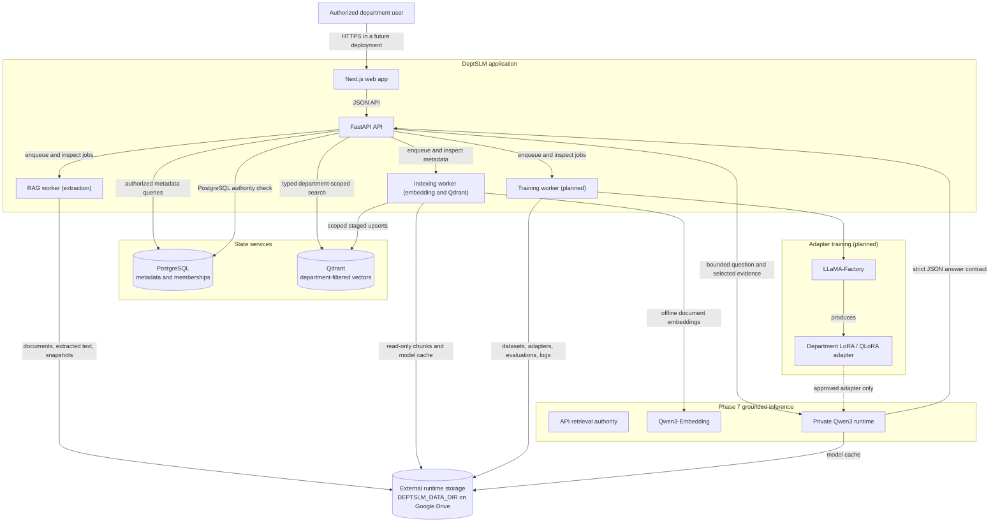

# Planned Architecture

## Status and boundaries

Phase 7's one-turn grounded-answer boundary is complete. Phase 8 adds structured PostgreSQL-only feedback, a constrained same-department review workflow, server-time expiry, and explicit authorized purge. Phase 9 completed the internal department-scoped evaluation runner; Phase 10 completed the metadata-only builder for human-authored supervised fine-tuning dataset artifacts; Phase 11 completed the isolated LlamaFactory job-bundle generator that never executes training. Phase 12 is under review with documentation-only Phase 12.0 adapter registry contracts. Feedback persists no question, answer, prompt, evidence, or free text and cannot contact Qdrant, artifacts, or the private runtime. Public vector search, conversations, streaming, reranking, training, adapter intake, and runtime adapter routing remain unimplemented.

Phase 9 publication is deliberately non-atomic across PostgreSQL and external storage. A server-generated publication UUID and exact positive run attempt number bind each staged and final result manifest to the department, suite, run, and code revision. Result staging and publication run in killable leased children; PostgreSQL writes the succeeded state only after descriptor-relative no-follow final-artifact verification. Reclaim and the administrator-only `reconcile-artifacts` command delete only an exact manifest-proven, non-succeeded attempt. Reconciliation records a durable content-free batch before filesystem mutation and terminalizes the owned run or suite metadata with one batch audit, so a later authorized invocation can resume a crash window. They never delete unknown, mismatched, succeeded, or committed artifacts. A crash after an external rename can therefore leave an untrusted orphan, but never an authoritative result.

## System context

DeptSLM is planned as a department-isolated monorepo application. The web client will call a FastAPI control plane. PostgreSQL will hold application metadata and authorization relationships; Qdrant will hold embeddings with department-scoped payloads. Long-running ingestion and training work will live outside request handlers. File-based artifacts will be stored outside the checkout under `DEPTSLM_DATA_DIR`.

```mermaid
flowchart TB
    User["Authorized department user"]

    subgraph App["DeptSLM application"]
        Web["Next.js web app"]
        API["FastAPI API"]
        RAG["RAG worker (extraction)"]
        Index["Indexing worker (embedding and Qdrant)"]
        Train["Training worker (planned)"]
    end

    subgraph Data["State services"]
        PG[("PostgreSQL\nmetadata and memberships")]
        QD[("Qdrant\ndepartment-filtered vectors")]
    end

    subgraph RAGStack["Phase 7 grounded inference"]
        Retrieve["API retrieval authority"]
        Embed["Qwen3-Embedding"]
        Runtime["Private Qwen3 runtime"]
    end

    subgraph TrainingStack["Adapter training (planned)"]
        Factory["LLaMA-Factory"]
        Adapter["Department LoRA / QLoRA adapter"]
    end

    Drive[("External runtime storage\nDEPTSLM_DATA_DIR on Google Drive")]

    User -->|"HTTPS in a future deployment"| Web
    Web -->|"JSON API"| API
    API -->|"authorized metadata queries"| PG
    API -->|"enqueue and inspect jobs"| RAG
    API -->|"enqueue and inspect metadata"| Index
    API -->|"enqueue and inspect jobs"| Train
    API -->|"typed department-scoped search"| QD
    API -->|"PostgreSQL authority check"| PG
    API -->|"bounded question and selected evidence"| Runtime
    Index -->|"offline document embeddings"| Embed
    Index -->|"scoped staged upserts"| QD
    Runtime -->|"strict JSON answer contract"| API
    Train --> Factory
    Factory -->|"produces"| Adapter
    Adapter -.->|"approved adapter only"| Runtime
    RAG -->|"documents, extracted text, snapshots"| Drive
    Index -->|"read-only chunks and model cache"| Drive
    Train -->|"datasets, adapters, evaluations, logs"| Drive
    Runtime -->|"model cache"| Drive
```

The arrows describe intended responsibilities and do not imply that a production queue, model server, or network protocol has been selected in Phase 0.

## Component responsibilities

### Next.js frontend

`apps/web` is the browser-facing interface. In future phases it is expected to provide department-scoped document management, ingestion status, chat, training and evaluation views, and administrative controls. It must not be treated as an authorization boundary; the API must independently authenticate and authorize every operation.

## Phase 10 SFT dataset boundary

The dataset builder accepts only reviewed, human-authored external source bundles. It revalidates every same-department source chunk against stored document, succeeded extraction, and succeeded indexing authority before generating a deterministic group-isolated train/validation split. `training_datasets` contains private contentful artifacts; PostgreSQL records content-free ownership manifests, counts, statuses, reviewed contracts, lifecycle timestamps, and file digests. It does not persist instructions, responses, provenance source identifiers, or artifact paths.

The builder has only PostgreSQL and `training_datasets` access. Its contentful selector and construction steps are fixed exec children with closed schemas, exact secret-free environments, `close_fds`, and only explicit private source/stage descriptors. It has no Qdrant, RAG runtime, model, Hugging Face, upload, extraction, evaluation-result, adapter, export, database socket, or application-auth-secret access. A selector child emits only sorted chunk UUIDs; the parent streams them through bounded PostgreSQL authority batches and writes a private provenance-ID mapping for the build child. The mapping remains on its retained descriptor through child construction and is verified by exact digest, size, and stage-entry identity before use. Requests and responses use bounded framed IPC while the parent retains PostgreSQL-server-time lease ownership; source text, dataset bytes, and complete authority mappings never traverse the IPC channel.

Each source-import authority scan uses a repeatable-read PostgreSQL snapshot and bounded locked batches. Every long parent filesystem and authority operation has its own deadline, heartbeat, cancellation, shutdown, and claim-loss checkpoint. Filesystem publication and PostgreSQL success cannot be atomic: final artifacts are fully hashed before locks, then their exact directory and file descriptors stay open through the success transaction for identity-only rechecks. Each active or claim-time terminal build has one metadata-only build-attempt record; reclaim preserves every prior attempt for exact-attempt cleanup. Every incomplete lifecycle registers its stage plus any manifest-proven final surface for reconciliation, keyed by resource and attempt UUID; a blocked final artifact keeps that exact attempt cleanup unconfirmed. An orphaned artifact is never Phase 11 authority.

## Phase 11 training-job boundary (completed)

Phase 11 consumes exactly one succeeded, approved, unpurged Phase 10 dataset in the same department. Enqueue freezes a complete content-free snapshot of its identity, version, publication attempt, contracts, digests, sizes, and counts; worker startup and final locked authority both compare every field. The separate `training-job-worker` leases a PostgreSQL-backed job, verifies the retained dataset through descriptor-relative no-follow handles, and starts a fixed child with only the dataset and fresh staging descriptors. The child validates the closed Phase 10 records, preserves train and validation bytes exactly, and writes a deterministic LlamaFactory 0.9.5 `training.yaml`, `dataset_info.json`, data copies, and closed manifest. No source content, dataset bytes, configuration bytes, paths, hashes, execution token, or model/adaptor output enters PostgreSQL, logs, audit rows, public APIs, or frontend state.

The worker receives only PostgreSQL and `training_datasets`; it has no model, tokenizer, LlamaFactory package, Hugging Face token, Qdrant, RAG runtime, upload, extraction, evaluation, adapter, or cloud configuration. It never runs the generated configuration. Stale cleanup, authority loading, descriptor hashing, stage preparation, child execution, publication steps, and final source reauthorization retain independent parent lease checkpoints. The parent renews a fresh lease guard before, never inside, the final locked transaction; that transaction uses PostgreSQL server time for the final ownership check. Purge uses a durable review-fencing reservation binding the exact succeeded attempt, content-free manifest, and UUID tombstone namespace. Stages must complete before final-deletion authorization; the verified final moves without replacement to private tombstone storage, then a separate committed `tombstone_bound` state records exact parent, directory, and fixed-file identities before cleanup. Retries reject any replacement or unbound partial tombstone; only a durably in-flight exact unlink may be absent. A purge operation records per-job progress and emits at most one success audit after its active reservations close. A pre-move ownership failure leaves the final intact; a post-move cleanup failure leaves the reservation active. PostgreSQL and external storage remain non-atomic: an artifact without committed succeeded PostgreSQL authority is not eligible for review or future adapter use.

## Phase 12 adapter registry boundary (under review; contract only)

Phase 12.0 defines a future external adapter intake and immutable,
department-scoped registry. It does not add a database model, migration, API
route, worker, service, mount, dependency, adapter file, or runtime loading.
The proposed final artifact allowlist is exactly `manifest.json`,
`adapter_config.json`, and `adapter_model.safetensors`; adapters are untrusted
until their exact safetensors, closed configuration, same-department Phase 10
dataset lineage, and Phase 11 training-job lineage are validated. The reviewed
base contract is `Qwen/Qwen3-0.6B` revision
`c1899de289a04d12100db370d81485cdf75e47ca` with Apache-2.0 metadata and
LlamaFactory `0.9.5`.

Future intake, evaluation evidence, review, approval, promotion, supersession,
rollback, and deployment events remain separate metadata boundaries. A
deployment will point to one exact immutable adapter version, and a department
will have at most one active deployment. Runtime routing must use one immutable
request snapshot, reject cross-department or base-revision mismatches, return a
safe failure when a required adapter cannot load, and never silently fall back
to the base model. Rollback-to-base must be explicit.

The proposed registry, `.staging`, and `.deleting` surfaces live only beneath
`DEPTSLM_DATA_DIR/adapters`, use private UUID-derived paths and descriptor-
relative no-follow verification, and remain outside Git. PostgreSQL and
external storage are non-atomic. Future reconciliation and purge must be
crash-resumable, operation-audited, and fenced against active deployments; they
must not delete Phase 10 datasets, Phase 11 job bundles, backups, or audit
history. See [adapter-registry.md](adapter-registry.md) for the full contract.

### FastAPI backend

`apps/api` is the control plane for development authentication, persistent department authorization, department administration, uploads, and extraction metadata. It enqueues PostgreSQL jobs but never opens sources for extraction, invokes parsers, normalizes, chunks, or waits for workers.

### PostgreSQL

PostgreSQL stores identities, departments, memberships, documents, extraction/chunk metadata, vector-indexing and RAG run metadata, structured feedback metadata, and safe mutation audit events. It is the reviewed extraction/indexing queue: workers claim with `SKIP LOCKED` and finite non-revivable leases. Feedback uses exact run/citation foreign keys, immutable submission, optimistic review versions, and server-time expiry. Feedback response statements aggregate the parent, run outcome, reasons, and sources in one PostgreSQL snapshot, preventing purge races from producing partial responses. The purge command has a database-only settings loader and never inspects runtime storage. Questions, answers, prompts, evidence, text, vectors, credentials, and filesystem paths never enter PostgreSQL.

### Qdrant

Qdrant 1.13.4 is the Phase 6 vector store for chunks embedded with the pinned Qwen3 contract. The fixed collection accepts exactly one named vector, `dense`; the adapter performs no point operation until the complete vector and payload-index schema is verified. Every operation requires typed `DepartmentScope`; fixed internal filters always include exact `department_id`, and searchable operations also require current pipeline plus `published=true`. Claim-owned mutations additionally require a live exact PostgreSQL claim and fixed contract. Payload contains IDs/provenance only, never text or hashes. Direct client calls outside the reviewed adapter are forbidden. Public search remains deferred.

### Extraction/indexing workers and grounded answering

The extraction path stream-copies each canonical source into a private verified claim snapshot and gives only that read-only descriptor to the installed constrained parser. It publishes exactly `normalized.txt`, `chunks.jsonl`, and `manifest.json`. The separate indexing path revalidates those artifacts incrementally, sends bounded requests to a secret-free offline embedding subprocess through interruptible nonblocking IPC, and stages content-free Qdrant points before exact-attempt activation. Reclaim verifies prior-attempt cleanup before processing and again before activation. Both use PostgreSQL server-time leases and exact stale cleanup.

For Phase 7, the API uses the same reviewed Qdrant adapter and PostgreSQL retrieval authority, then incrementally reads only selected exact chunks. It sends bounded evidence with server-owned labels to a private runtime, validates strict citations, and reauthorizes plus revalidates every supplied source before success; only the cited subset is returned and persisted. The runtime HTTP process supervises one persistent model child through bounded framed IPC. Startup and operation clocks are separate. Over-token inputs preserve the healthy loaded child; fatal operations terminate and reap it, then launch one bounded shared background replacement while readiness is false and new work fails fast. Disconnect/cancellation cannot leave a child or cancel that shared recovery. The model child receives a strict secret-free environment without the runtime bearer token. LlamaIndex is not introduced.

Retrieved text is untrusted content. Prompt assembly must delimit it as evidence, prevent instructions in it from overriding higher-priority policy, and include only sources from the authorized department. If retrieval does not yield usable evidence, the assistant must state that it does not have enough information rather than generate a department-specific claim.

### Qwen3 and Qwen3-Embedding

Phase 6 fixes `Qwen/Qwen3-Embedding-0.6B` revision `d23109d65ca9fdf61eef614209744716f337f50f`, normalized 1024-dimensional output, and cosine distance. Phase 7 fixes `Qwen/Qwen3-0.6B` revision `c1899de289a04d12100db370d81485cdf75e47ca`, non-thinking mode, a 40,960-token pinned context contract, an 8,192-token operational generation-input limit, and a 512-token response reserve. Query embedding has a separate 2,048-token input limit. Complete tokenizer inputs are checked without truncation. Normal processes load only verified external safetensors offline with remote code disabled. Hardware/bitwise reproducibility, production serving, and final licensing review remain operational limitations; weights and caches never enter Git.

### LLaMA-Factory and the training worker

Phase 11's training-job worker generates immutable bundles but does not launch
LLaMA-Factory. A future Phase 12 implementation may consume one exact approved
bundle through a separately reviewed external adapter intake. Training data,
outputs, logs, and adapters remain under `DEPTSLM_DATA_DIR`; every dataset,
job, evaluation, and adapter is department-scoped and bound to an exact
base-model revision. No cross-department adapter fallback is permitted.

### Shared package

`packages/shared` is reserved for contracts or utilities that genuinely need to be shared. It should not become a dumping ground or create a runtime dependency from Python to TypeScript; cross-language contracts should use an explicit schema or generated client once APIs stabilize.

## Planned workflows

### Document ingestion

1. The API authenticates the user, performs a short admission check, and validates the raw upload headers.
2. The upload streams to a private staging file beneath that department's external `uploads` path.
3. A new transaction locks the department, revalidates authority, enforces quota, atomically finalizes the source, and records metadata plus audit evidence.
4. The Phase 5 RAG worker claims the PostgreSQL job, creates and verifies an immutable source snapshot, extracts through the constrained subprocess and separate scratch space, re-verifies the canonical source, and publishes the exact normalized/chunk/manifest allowlist with page/line/character provenance.
5. The Phase 6 indexing worker validates the exact artifacts and PostgreSQL chunk rows, creates bounded offline embeddings, and stages content-free points with exact department/job/attempt scope.
6. It verifies count, revalidates PostgreSQL authority, repeats exact prior-attempt cleanup when reclaiming, activates only the replacement attempt, and then records job success plus audit metadata.
7. Future retrieval must filter by department/current publication and cross-check every result against succeeded PostgreSQL authority.

Phase 5 adds explicit failed-attempt retry, exact expired-claim staging recovery, and cancellation of queued work on soft deletion. A never-reclaimed crash can retain staging, and a crash between filesystem publication and database commit can retain an unknown final orphan. Malware controls, OCR, download, physical retention, and final-orphan reconciliation remain deferred.

### Department-scoped question answering

1. The API authenticates the caller and resolves the authorized department.
2. Retrieval queries Qdrant with a mandatory `department_id` filter.
3. PostgreSQL cross-checks every candidate and the API deterministically selects bounded sources above the provisional threshold.
4. The API reads only selected verified artifacts and labels them as untrusted evidence.
5. The private HTTP supervisor sends the request to its killable secret-free model child, which returns strict non-thinking JSON using no adapter and fixed token budgets.
6. The API reloads the complete evidence set, validates citations, reauthorizes, and revalidates every supplied source before returning only the cited subset as safe metadata. With no adequate source, it returns the defined insufficient-information behavior without generation when possible.

### Adapter training and promotion

1. An authorized operator creates or selects a reviewed department dataset.
2. The training worker records the base-model revision and LLaMA-Factory configuration.
3. LLaMA-Factory produces a department-bound adapter under external storage.
4. Automated and human evaluation compare the candidate with the current approved behavior.
5. An authorized promotion action makes the adapter available to that department; rollback remains possible.

The exact training scheduler, GPU execution environment, registry schema, and approval workflow are future decisions.

## Isolation and trust boundaries

`department_id` is a mandatory security boundary, not a UI filter. In future phases it must be enforced in authentication-derived request context, PostgreSQL queries and constraints, Qdrant payload filters, job messages, paths, cache keys, adapters, logs, evaluations, and exports. Client-provided identifiers are not sufficient authorization. Missing or ambiguous scope must fail closed.

The browser, uploaded files, extracted text, document metadata, retrieved passages, and model output are untrusted. The API must validate inputs and authorize operations; prompt assembly must resist document-borne instructions; rendered output must be escaped for its context. Secrets should enter through environment or a future secret manager and must not be exposed to prompts or logs.

## Persistence boundary

The repository is for source code only. All file-based runtime artifacts derive from the required `DEPTSLM_DATA_DIR`; in the user's local environment it points to Google Drive. No component may silently create runtime directories inside the checkout. Tests and CI substitute isolated temporary directories. See [storage-policy.md](storage-policy.md).

PostgreSQL and Qdrant are service state. The Compose stack is for local development only; before either stores real data, its persistence, backup, and recovery design must be reviewed to ensure no runtime files are written into the repository and that department deletion and retention requirements can be met.

## Phase 9 evaluation boundary

The internal evaluator is a metadata control plane plus a dedicated non-model worker. Immutable suites and content-free result artifacts live beneath external `eval_results`; PostgreSQL stores suite/run/case-result metadata and numeric metrics only. The evaluator reuses the exact Phase 7 production pipeline and delegates embedding and generation to the existing internal runtime. It mounts `extracted_text` read-only and `eval_results` read-write, with no uploads, model cache, training data, adapters, exports, model stack, or Hugging Face token.

PostgreSQL claims, Qdrant retrieval, Phase 5 artifacts, result publication, and the runtime do not share a transaction. The evaluator runs blocking suite reads, production-policy cases, and final authority checks in killable child groups while the parent retains PostgreSQL-server-time lease ownership. It captures complete case-source snapshots outside locks, then rechecks identities and deterministic source locks immediately before publication. Those controls fail closed but do not establish distributed atomicity, remote-request fencing, or production availability. Phase 8 feedback is not read.

## Deferred decisions

- Authentication provider, SSO integration, and role model
- Production queue/worker scaling beyond the Phase 5 PostgreSQL lease queue
- Exact Qwen3 variants, serving runtime, and hardware profiles
- Production extraction sandbox, malware controls, and additional reviewed formats
- Hybrid retrieval, reranking, and relevance thresholds beyond the Phase 5 character chunker
- Production retention, physical purge, reconciliation, and tamper-resistant audit requirements
- Phase 12.1 through 12.4 adapter implementation and runtime deployment
- Production topology, secrets, observability, backup, and disaster recovery
