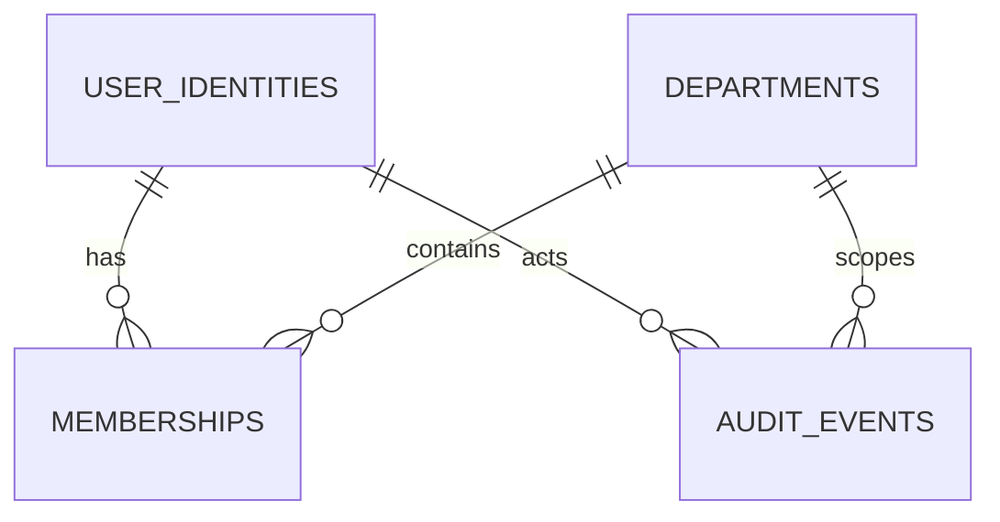

# Phase 3 Database Model

Phase 3 uses PostgreSQL 16, SQLAlchemy 2, psycopg 3, and Alembic. Alembic revision `0001_phase3` is the only schema-creation mechanism; the API never calls `metadata.create_all`.

## Entities



- `user_identities`: UUID identity keyed uniquely by the exact opaque `(issuer, subject)`. Subjects are not lowercased or interpreted as email addresses. Status is `active`, `suspended`, or `revoked`.
- `departments`: UUID department with a unique canonical lowercase slug, display name, lifecycle status, and version. Slugs are immutable through Phase 3 APIs.
- `memberships`: unique `(user_id, department_id)` assignment with one reviewed role, lifecycle status, optional expiry, creator, and version. Security foreign keys use `RESTRICT`, not cascading deletion.
- `audit_events`: append-only application interface for safe mutation metadata. It intentionally has no token, secret, request body, document, training content, or database URL fields.

Departments are archived and memberships are revoked; neither has a hard-delete API. Archived departments, inactive identities or memberships, and expired memberships cannot authorize access. Mutation and audit rows are flushed and committed in the same request transaction.

## Migrations

From `apps/api`, with `DATABASE_URL` set to a `postgresql+psycopg://` URL:

```bash
python -m alembic upgrade head
python -m alembic current
python -m alembic downgrade base  # isolated development/test database only
```

Production migration execution, backup, recovery, and rollback procedures remain deferred. Never point destructive migration tests at a shared or production database.
