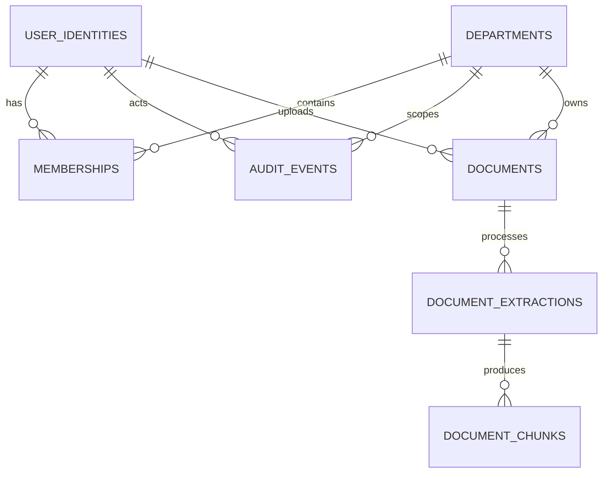

# Phase 5 Database Model

DeptSLM uses PostgreSQL 16, SQLAlchemy 2, psycopg 3, and Alembic. Revision `0003_phase5_extraction` follows the Phase 3 identity/department and Phase 4 document revisions. Alembic is the only schema-creation mechanism; runtime never calls `metadata.create_all`.

## Entities



- `user_identities`: UUID identity keyed uniquely by the exact opaque `(issuer, subject)`. Subjects are not lowercased or interpreted as email addresses. Status is `active`, `suspended`, or `revoked`.
- `departments`: UUID department with a unique canonical lowercase slug, display name, lifecycle status, and version. Slugs are immutable through Phase 3 APIs.
- `memberships`: unique `(user_id, department_id)` assignment with one reviewed role, lifecycle status, optional expiry, creator, and version. Security foreign keys use `RESTRICT`, not cascading deletion.
- `audit_events`: append-only application interface for safe mutation metadata. It intentionally has no token, secret, request body, document, training content, or database URL fields.
- `documents`: department-owned source metadata with an internal uploader relation, normalized filename, canonical media type, positive size, SHA-256 digest, lifecycle state, version, and timestamps. It stores no body or path, and public document schemas do not expose internal identity IDs; see [document-model.md](document-model.md).
- `document_extractions`: immutable attempt history and PostgreSQL queue state, including source/pipeline identity, claim lease, safe result metadata, and an allowlisted error code. It stores no content, path, filename, stderr, or exception.
- `document_chunks`: department/document/extraction-scoped offsets, byte size, internal digest, and mutually exclusive page/line provenance. Chunk text remains external.

Composite unique and `RESTRICT` foreign-key constraints bind documents, extractions, retries, and chunks to the same department/document. Partial unique indexes allow one active attempt per document and one successful result per source checksum/pipeline. Lifecycle checks make queued, running, succeeded, failed, and cancelled metadata internally consistent.

Departments are archived and memberships are revoked; neither has a hard-delete API. Archived departments, inactive identities or memberships, and expired memberships cannot authorize access. Mutation and audit rows are flushed and committed in the same request transaction.

Issuer and opaque subject values preserve their exact meaningful characters; database constraints reject empty or whitespace-only values. They are never lowercased or reinterpreted.

Document filename checks are defined identically in the SQLAlchemy model and revision `0002_phase4_documents`: the value must contain a non-whitespace character, `char_length` must not exceed 255, and `octet_length` must not exceed 255. The byte constraint prevents a valid character count from exceeding the storage contract when UTF-8 encoded.

## Transaction and administrator invariants

Department reads and mutations revalidate the actor in the request-scoped database session. Mutations lock the active department row first, then the acting identity/membership, then any target identity/membership. This consistent order serializes administrator-changing operations per department and closes stale-context gaps after revocation, suspension, expiry, demotion, or archival.

An effective administrator requires an active department, active `UserIdentity`, active membership, an unexpired membership, and role `department_admin` or same-department `system_admin`. Suspended or revoked identities and inactive or expired memberships do not count. An active department cannot lose its final effective administrator through membership mutation. PostgreSQL row locking covers application mutations; direct out-of-band SQL remains an operational trust boundary.

## Migrations

From `apps/api`, with `DATABASE_URL` set to a `postgresql+psycopg://` URL:

```bash
python -m alembic upgrade head
python -m alembic current
python -m alembic downgrade base  # isolated development/test database only
```

Production migration execution, backup, recovery, and rollback procedures remain deferred. Never point destructive migration tests at a shared or production database. Phase 5 migration tests require PostgreSQL 16 and exercise `0002` to `0003`, empty-to-head, downgrade/upgrade, and repeated-head behavior.

For Compose, use `./scripts/compose.sh run --rm api python -m alembic upgrade head`. Its `DATABASE_URL` uses the internal `postgres` hostname; host-shell commands must use `localhost` or another host-accessible address.
