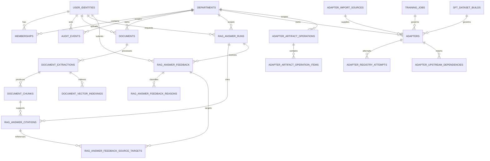

# Database Model Through Phase 12.1E-A

DeptSLM uses PostgreSQL 16, SQLAlchemy 2, psycopg 3, and Alembic. Revision
`0012_phase12_adapter_reconciliation` is the current head after
`0011_phase12_adapter_registry`. Alembic is the only schema-creation
mechanism; runtime never calls `metadata.create_all`.

## Entities


```mermaid
erDiagram
    USER_IDENTITIES ||--o{ MEMBERSHIPS : has
    DEPARTMENTS ||--o{ MEMBERSHIPS : contains
    USER_IDENTITIES ||--o{ AUDIT_EVENTS : acts
    DEPARTMENTS ||--o{ AUDIT_EVENTS : scopes
    DEPARTMENTS ||--o{ DOCUMENTS : owns
    USER_IDENTITIES ||--o{ DOCUMENTS : uploads
    DOCUMENTS ||--o{ DOCUMENT_EXTRACTIONS : processes
    DOCUMENT_EXTRACTIONS ||--o{ DOCUMENT_CHUNKS : produces
    DOCUMENT_EXTRACTIONS ||--o{ DOCUMENT_VECTOR_INDEXINGS : indexes
    DEPARTMENTS ||--o{ RAG_ANSWER_RUNS : scopes
    USER_IDENTITIES ||--o{ RAG_ANSWER_RUNS : requests
    RAG_ANSWER_RUNS ||--o{ RAG_ANSWER_CITATIONS : cites
    DOCUMENT_CHUNKS ||--o{ RAG_ANSWER_CITATIONS : supports
    RAG_ANSWER_RUNS ||--o{ RAG_ANSWER_FEEDBACK : receives
    USER_IDENTITIES ||--o{ RAG_ANSWER_FEEDBACK : submits
    RAG_ANSWER_FEEDBACK ||--o{ RAG_ANSWER_FEEDBACK_REASONS : classifies
    RAG_ANSWER_FEEDBACK ||--o{ RAG_ANSWER_FEEDBACK_SOURCE_TARGETS : targets
    RAG_ANSWER_CITATIONS ||--o{ RAG_ANSWER_FEEDBACK_SOURCE_TARGETS : references
    DEPARTMENTS ||--o{ ADAPTERS : owns
    ADAPTER_IMPORT_SOURCES ||--o{ ADAPTERS : supplies
    TRAINING_JOBS ||--o{ ADAPTERS : governs
    SFT_DATASET_BUILDS ||--o{ ADAPTERS : governs
    ADAPTERS ||--o{ ADAPTER_REGISTRY_ATTEMPTS : attempts
    ADAPTERS ||--o{ ADAPTER_UPSTREAM_DEPENDENCIES : retains
    DEPARTMENTS ||--o{ ADAPTER_ARTIFACT_OPERATIONS : scopes
    ADAPTER_ARTIFACT_OPERATIONS ||--o{ ADAPTER_ARTIFACT_OPERATION_ITEMS : contains
```

- `user_identities`: UUID identity keyed uniquely by the exact opaque `(issuer, subject)`. Subjects are not lowercased or interpreted as email addresses. Status is `active`, `suspended`, or `revoked`.
- `departments`: UUID department with a unique canonical lowercase slug, display name, lifecycle status, and version. Slugs are immutable through Phase 3 APIs.
- `memberships`: unique `(user_id, department_id)` assignment with one reviewed role, lifecycle status, optional expiry, creator, and version. Security foreign keys use `RESTRICT`, not cascading deletion.
- `audit_events`: append-only application interface for safe mutation metadata. It intentionally has no token, secret, request body, document, training content, or database URL fields.

## Phase 11 training-job metadata

`training_jobs`, `training_job_attempts`, bounded artifact-operation rows, and job-level purge reservations record department scope, the complete exact Phase 10 dataset snapshot, fixed LlamaFactory/model/profile contracts, lifecycle, review state, execution ownership, content-free file digests and counts, and retention cleanup state. A succeeded job requires a non-null publication attempt, closed object manifest, positive train/validation counts, result manifest digest, and positive digest/size metadata for all four payloads. Staged, published, and succeeded attempts require their closed ownership manifest and lifecycle timestamps. Application authority additionally requires the job's manifest to exactly equal the one matching succeeded attempt manifest and every closed manifest field to match the job row.

A purge reservation captures the expected job version, review status, server-time anchor, retention period, and durable registered/deletion-authorized/terminalized lifecycle before any external deletion. Each job operation contains unresolved attempt-stage items plus exactly one final item for the authoritative succeeded owner; historical manifests never create duplicate final ownership. They contain no dataset records, configuration bytes, source chunk identifiers, artifact paths, model outputs, adapters, logs, tokens, or credentials. Composite department constraints keep attempts and cleanup operations scoped to the same job department.

## Phase 12.1B adapter source metadata

Revision `0010_phase12_adapter_sources` adds only `adapter_import_sources` and
`adapter_import_attempts`. A source row is a department-scoped, server-generated
content-free authority record for exactly one immutable external source bundle.
An attempt row records the registered, validated, staged, published, committed,
failed, or abandoned lifecycle and a closed ownership manifest. Composite
department/source foreign keys, a globally unique publication-attempt UUID, and
a partial unique active-attempt index prevent cross-department or concurrent
source ownership. The source status supports later `claimed`, `consumed`,
`purge_pending`, and `purged` states, but Phase 12.1B creates none of those
transitions.

The tables retain contract identifiers, fixed model revision, dtype/count/size
summary, lowercase SHA-256 digests, positive sizes, versions, and safe error
codes only. They contain no adapter bytes, configuration JSON, tensor names or
values, host paths, filenames, manifests supplied by an operator, credentials,
or training provenance. PostgreSQL and external storage publication are not
atomic; Phase 12.1E-A adds separate reconciliation metadata for four
non-authoritative adapter artifact surfaces, while later purge and adapter
lifecycle phases are not implemented here.

## Phase 12.1C adapter registry metadata

Revision `0011_phase12_adapter_registry` adds the `adapters`,
`adapter_registry_attempts`, and `adapter_upstream_dependencies` tables and
adds source claim/consumption fields plus the exact claimed-adapter foreign
key. Composite department foreign keys are restrictive; no database cascade
can cross a tenant boundary or delete upstream artifacts. A queued adapter
captures the complete content-free source, succeeded Phase 11, and Phase 10
authority snapshots, including immutable publication IDs, versions, code
revisions, contract versions, digests, sizes,
counts, and governance booleans.

The registry lifecycle is `queued` → `running` → `validated` (or a fixed
failure state), while each publication attempt records staged, published,
succeeded, failed, validation-failed, or reclaimed metadata. `active` upstream
dependencies fence the exact Phase 11 job and Phase 10 dataset from purge until
a later reviewed lifecycle releases them. The registry stores only UUIDs,
states, contracts, aggregate tensor metadata, positive sizes, SHA-256 values,
timestamps, and safe error codes; it stores no adapter bytes, tensor values,
dataset records, prompts, model output, paths, credentials, or runtime settings.
The worker's final success audit and source `consumed` transition occur in one
short PostgreSQL transaction after descriptor-bound final artifact verification.
The source claim is constrained by `(adapter_id, department_id, source_bundle_id)`;
the adapter stores exact composite references to the committed source attempt,
the succeeded Phase 11 attempt, and the succeeded Phase 10 attempt. Matching
unique targets are created in `0011` and removed on downgrade. The dependency
row additionally references the adapter's exact job/dataset snapshot. SQL and
ORM checks freeze the model/revision/license, PEFT and safetensors contracts,
LlamaFactory/profile contracts, lowercase hashes, positive file sizes/counts,
exact tensor aggregates, and the `declared_external_training_association` /
`training_provenance_verified` distinction. The worker compares an evolving
version snapshot before each transition and final authority transaction.

## Phase 12.1D metadata-only reads

Phase 12.1D adds no migration and no new table. The two read routes project
existing `adapters`, `adapter_import_sources`, and
`adapter_upstream_dependencies` rows through a closed PostgreSQL-only schema.
The service requires an exact same-department source association and matching
Phase 11/Phase 10 retention dependency before returning a row. A non-purged
adapter must retain an active dependency; a purged historical adapter may show
the released dependency and release timestamp.

Reads authorize `system_admin`, `department_admin`, and `instructor` through
the normal request-time membership resolver. Students, viewers, inactive or
expired memberships, archived departments, and cross-department selectors fail
closed. They do not append audit events, increment versions, inspect external
registry storage, or expose bytes, paths, hashes, tensor data, identities,
secrets, or runtime settings. Phase 12.1E-A adds separate reconciliation
operation/item authority and does not alter these read rows.

## Phase 12.1E-A reconciliation metadata

Revision `0012_phase12_adapter_reconciliation` adds
`adapter_artifact_operations` and `adapter_artifact_operation_items`. An
operation is a bounded, department-scoped, administrator-authorized,
dry-run-by-default batch. Its item rows bind exactly one source or registry
resource, publication attempt, attempt number, expected resource/attempt
versions, surface, and optional closed final manifest. Composite restrictive
foreign keys prevent cross-department or cross-attempt ownership.

Items move through `registered`, `verified`, `tombstone_bound`, `deleting`,
`completed`, or `blocked`. `verified` stores the closed observed identity and
deletion plan; a separate `move_authorized_at` plus the exact item-scoped
`expected_tombstone_namespace` must be committed before rename. `tombstone_bound`
stores the post-rename identity and is the only state that may unlink. JSON
fields contain only descriptor identities, allowlisted entry names,
digests/sizes for complete finals, and crash-resume progress; they never
contain adapter bytes, manifests from partial stages, paths, credentials,
tensor values, or dependency data. A terminal item can set the source/registry
attempt's `cleanup_confirmed_at` only after every applicable surface and
tombstone for that exact attempt is absent across all operations and no
authoritative sibling exists. Candidate selection is database-bounded: each
surface locks at most `min(limit * 8, 1000)` rows, aggregates history only for
those exact rows, and uses bulk sibling checks rather than unbounded
department-wide or N+1 queries. Untried stages and finals precede blocked
retries; blocked siblings rotate by their exact retry counts and most recent
blocked generation. The operation appends one safe success audit when at least
one item completes, including a `completed_with_blocks` operation, while an
all-blocked operation appends none. Blocked item rows remain immutable history;
a later authorized operation records a fresh retry generation after repair,
and a blocked item cannot starve a later untried sibling.
- `documents`: department-owned source metadata with an internal uploader relation, normalized filename, canonical media type, positive size, SHA-256 digest, lifecycle state, version, and timestamps. It stores no body or path, and public document schemas do not expose internal identity IDs; see [document-model.md](document-model.md).
- `document_extractions`: immutable attempt history and PostgreSQL queue state, including source/pipeline identity, claim lease, safe result metadata, and an allowlisted error code. It stores no content, path, filename, stderr, or exception.
- `document_chunks`: department/document/extraction-scoped offsets, byte size, internal digest, and mutually exclusive page/line provenance. Chunk text remains external.
- `document_vector_indexings`: department/document/extraction-scoped queue/history with the fixed model/vector contract, safe counts/errors, retry relation, claim/lease authority, and no text, vectors, paths, URLs, keys, or raw Qdrant data.
- `rag_answer_runs`: department/requestor-scoped content-free attempt metadata with lifecycle, safe counts/errors, and exact embedding, generation, prompt, and answer-contract versions.
- `rag_answer_citations`: restrictive run/department/document/extraction/indexing/chunk provenance with server label, rank, internal score, ordinal, and page/line range. It stores no answer or evidence.
- `rag_answer_feedback`: one immutable structured submission per department/run/requester, with sentiment, constrained review lifecycle, internal submitter/reviewer relations, PostgreSQL-server-time expiry, optimistic version, and no content.
- `rag_answer_feedback_reasons`: one through five server-ordered reviewed reason identifiers, or zero through four for helpful feedback, with exact parent department/run scope and no free text.
- `rag_answer_feedback_source_targets`: up to eight ordered exact citation references from the same department and run; it duplicates no label, filename, text, score, hash, path, document, extraction, or indexing metadata.

Composite unique and `RESTRICT` foreign-key constraints bind documents, extractions, retries, and chunks to the same department/document. Partial unique indexes allow one active attempt per document and one successful result per source checksum/pipeline. Lifecycle checks make queued, running, succeeded, failed, and cancelled metadata internally consistent.

Departments are archived and memberships are revoked; neither has a hard-delete API. Archived departments, inactive identities or memberships, and expired memberships cannot authorize access. Mutation and audit rows are flushed and committed in the same request transaction.

Issuer and opaque subject values preserve their exact meaningful characters; database constraints reject empty or whitespace-only values. They are never lowercased or reinterpreted.

Document filename checks are defined identically in the SQLAlchemy model and revision `0002_phase4_documents`: the value must contain a non-whitespace character, `char_length` must not exceed 255, and `octet_length` must not exceed 255. The byte constraint prevents a valid character count from exceeding the storage contract when UTF-8 encoded.

## Transaction and administrator invariants

Department reads and mutations revalidate the actor in the request-scoped database session. Mutations lock the active department row first, then the acting identity/membership, then any target identity/membership. This consistent order serializes administrator-changing operations per department and closes stale-context gaps after revocation, suspension, expiry, demotion, or archival.

An effective administrator requires an active department, active `UserIdentity`, active membership, an unexpired membership, and role `department_admin` or same-department `system_admin`. Suspended or revoked identities and inactive or expired memberships do not count. An active department cannot lose its final effective administrator through membership mutation. PostgreSQL row locking covers application mutations; direct out-of-band SQL remains an operational trust boundary.

## Migrations

From `apps/api`, with `DATABASE_URL` set to a `postgresql+psycopg://` URL:

```bash
python -m alembic upgrade head
python -m alembic current
python -m alembic downgrade base  # isolated development/test database only
```

Production migration execution, backup, recovery, and rollback procedures remain deferred. Never point destructive migration tests at a shared or production database. Phase 8 tests require PostgreSQL 16 and exercise `0005` to `0006`, empty-to-head, downgrade/upgrade, repeated-head behavior, ORM synchronization, lifecycle checks, exact feedback/run/citation scope, immutable idempotency, review concurrency, server-time retention, purge, and audit.

`document_vector_indexings` permits at most one queued/running job per extraction and embedding pipeline and one succeeded job per extraction/current model revision/dimension/vector schema. Failed attempts do not block explicit retry. Workers use PostgreSQL server time and `SKIP LOCKED`; an expired claim cannot heartbeat, fail, requeue, activate, or finalize.

For Compose, use `./scripts/compose.sh run --rm api python -m alembic upgrade head`. Its `DATABASE_URL` uses the internal `postgres` hostname; host-shell commands must use `localhost` or another host-accessible address.

Phase 7 deliberately does not persist question text, answer text, prompts, retrieved evidence, raw model output, query vectors, hashes, paths, tokens, or dependency configuration. `rag.answer.complete` and citation rows commit only with an answered or insufficient terminal state. PostgreSQL cannot make Qdrant, external artifact reads, or model inference atomic; final short-transaction revalidation is the acceptance authority.

Phase 8 preserves that prohibition. Feedback tables add no question, answer, prompt, evidence, excerpt, comment, note, vector, model output, filename, path, hash, token, URL, or Qdrant field. Database checks enforce the sentiment/status/resolution allowlists, lifecycle shape, positive version, expiry ordering, and bounded child ranks. Composite restrictive foreign keys bind parent, reason, source target, run, department, and exact citation. Application transactions enforce compatible reasons, contiguous canonical ranks, immutability, reviewer transitions, version checks, and explicit oldest-first purge.

Revision `0007_phase9_evaluation_runner` adds `evaluation_suites`, `evaluation_runs`, and `evaluation_case_results`. Composite restrictive foreign keys bind department/suite/run scope. Checks enforce fixed contracts, active/archive and queue/run/terminal lifecycles, exact claim ownership shape, safe errors, counts, metric ranges, and content-free success artifacts. Questions, accepted/generated answers, prompts, evidence, vectors, source IDs, hashes of content, runtime responses, and paths are not columns.

Suite rows hold immutable contracts, counts, artifact digests, and Decimal gates. Run rows capture the exact production embedding/generation/prompt/vector contracts, code revision, seed policy, claim state, aggregate metrics, and final artifact digests. Case rows contain only statuses, counts, numeric metrics, booleans, and safe errors. Gate failure is a succeeded run with failed gate status; infrastructure failure has no final artifact hashes or completion audit.
